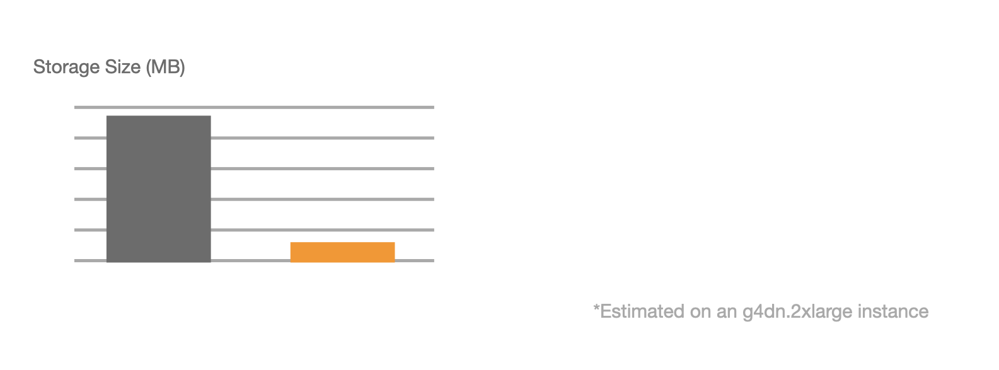
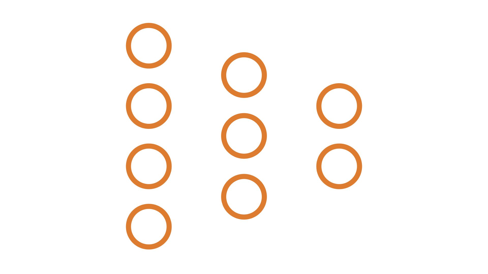
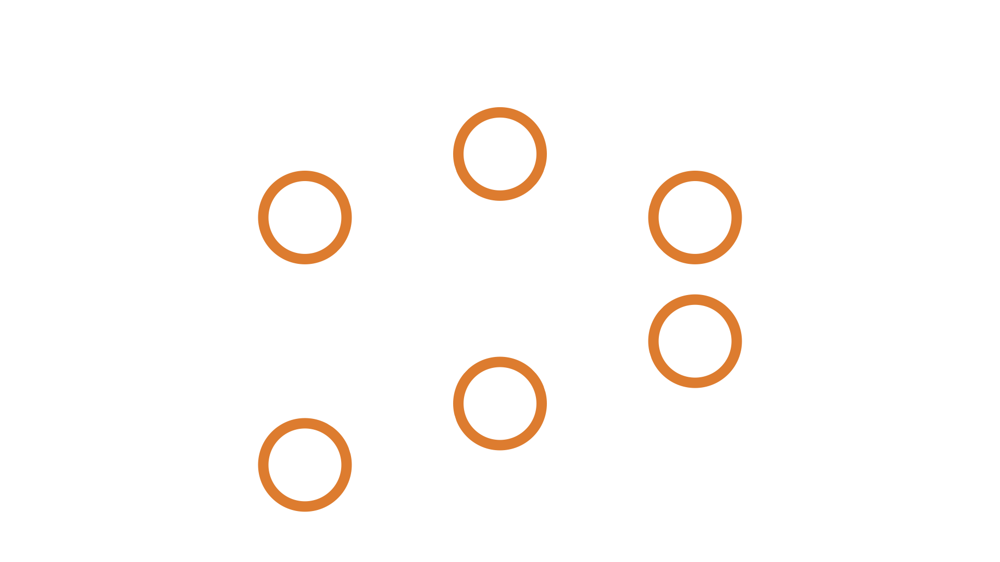
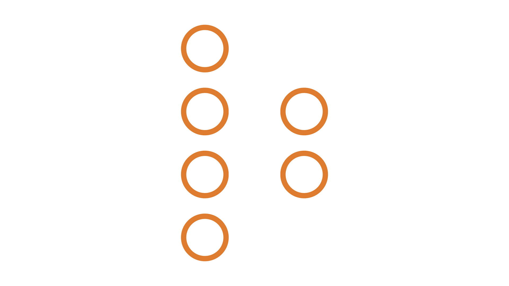
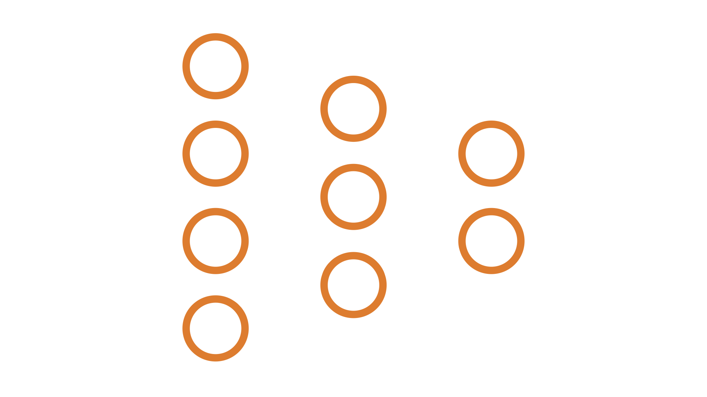
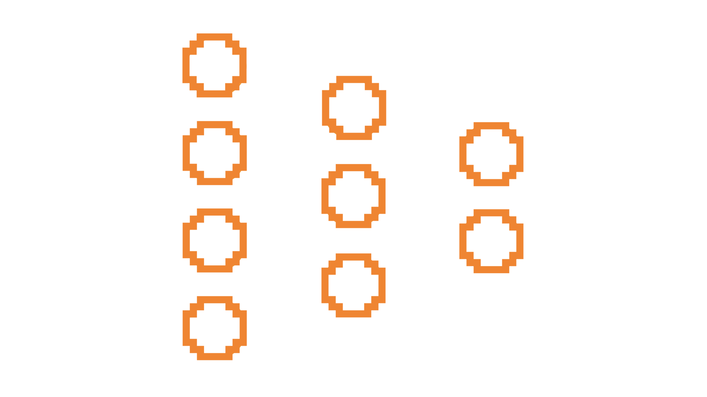

<p align="center">
    <a href="https://pypi.org/project/fasterai/"></a>
    <a href="https://pypi.org/project/fasterai/"></a>
    <a href="https://opensource.org/licenses/MIT"></a>
    <a href="https://pypi.org/project/fasterai/"></a>
</p>


<p align="center">
  <a href="#features">Features</a> •
  <a href="#installation">Installation</a> •
  <a href="#tutorials">Tutorials</a> •
  <a href="#join-the-community">Community</a> •
  <a href="#citing">Citing</a> •
  <a href="#license">License</a>
</p>

## Overview

fasterAI is a PyTorch-based library that makes neural networks **smaller**, **faster**, and **more efficient** through state-of-the-art compression techniques. The library provides simple but powerful implementations of pruning, knowledge distillation, quantization, and other network optimization methods that can be applied with just a few lines of code.

Why compress your models with fasterai?

* **Reduce model size** by up to 90% with minimal accuracy loss
* **Speed up inference** for deployment on edge devices
* **Lower energy consumptio**n for more sustainable AI
* **Simplify architectures** while maintaining performance


<div align="center">
  
</div>


---

##  Features

### 1. Sparsification

<div align="center">
  
</div>

Make your model sparse by replacing selected weights with zeros using `Sparsifier` or `SparsifyCallback`.

|Parameter|Description|Options|
|---|---|---|
|`sparsity`|Percentage of weights to zero out|0-100%|
|`granularity`|Level at which to apply sparsity|'weight', 'vector', 'kernel', 'filter'|
|`context`|Scope of sparsification|'local' (per layer), 'global' (whole model)|
|`criteria`|Method to select weights|'magnitude', 'movement', 'gradient', etc.|
|`schedule`|How sparsity evolves during training|'one_shot', 'iterative', 'gradual', etc.|

### 2. Pruning

<div align="center">
  
</div>

Remove zero-weight nodes from your network structure using `Pruner` or `PruneCallback`.

|Parameter|Description|Options|
|---|---|---|
|`pruning_ratio`|Percentage of weights to remove|0-100%|
|`context`|Scope of sparsification|'local' (per layer), 'global' (whole model)|
|`criteria`|Method to select weights|'magnitude', 'movement', 'gradient', etc.|
|`schedule`|How sparsity evolves during training|'one_shot', 'iterative', 'gradual', etc.|

### 3. Knowledge Distillation

<div align="center">
  
</div>

Transfer knowledge from a large teacher to a smaller student using `KnowledgeDistillationCallback`.

|Parameter|Description|Options|
|---|---|---|
|`teacher`|Teacher model|Any PyTorch model|
|`loss`|Distillation loss function|'SoftTarget', 'Logits', 'Attention', etc.|
|`activations_student`|Student layers to match|Layer names as strings|
|`activations_teacher`|Teacher layers to match|Layer names as strings|
|`weight`|Balancing weight for distillation|0.0-1.0|

### 4. Regularization

<div align="center">
  
</div>

Push weights toward zero during training using `RegularizeCallback`.

|Parameter|Description|Options|
|---|---|---|
|`criteria`|Regularization criteria|Same as sparsification criteria|
|`granularity`|Level of regularization|Same as sparsification granularity|
|`weight`|Regularization strength|Floating point value|
|`schedule`|How sparsity evolves during training|'one_shot', 'iterative', 'gradual', etc.|
|`layer_types`|Layer types to regularize|'nn.Conv2d', 'nn.Linear', etc.|

### 5. Quantization

<div align="center">
  
</div>

Reduce the precision of weights and activations using `Quantizer` or `QuantizeCallback`.

| Parameter        | Description                   | Options                    |
| ---------------- | ----------------------------- | -------------------------- |
| `backend`        | Target backend                | 'x86', 'qnnpack'           |
| `method`         | Quantization method           | 'static', 'dynamic', 'qat' |
| `use_per_tensor` | Force per-tensor quantization | True/False                 |


---

##  Quick Start

This is how easy it is to induce Sparsification in your PyTorch model:

```python
from fasterai.sparse.all import *

learn = vision_learner(dls, model)
learn.fit_one_cycle(n_epochs, cbs=SparsifyCallback(sparsity, granularity, context, criteria, schedule))
```

---

##  Installation


```
pip install git+https://github.com/nathanhubens/fasterai.git
```

or 

```
pip install fasterai
```

---

## Tutorials

- [Get Started with FasterAI](https://nathanhubens.github.io/fasterai/quickstart.html)
- [Create your own pruning schedule](https://nathanhubens.github.io/fasterai/tutorial.schedules.html)
- [Find winning tickets using the Lottery Ticket Hypothesis](https://nathanhubens.github.io/fasterai/tutorial.lottery_ticket.html)
- [Use Knowledge Distillation to help a student model to reach higher performance](https://nathanhubens.github.io/fasterai/tutorial.knowledge_distillation.html)
- [Sparsify Transformers](https://nathanhubens.github.io/fasterai/tutorial.transformers.html)
- Many more !

---


## Join the community

Join [our discord server](https://discord.gg/32BwhJSB9u) to meet other FasterAI users and share your projects!

---

##  Citing
```
@software{Hubens,
  author       = {Nathan Hubens},
  title        = {fasterai},
  year         = 2022,
  publisher    = {Zenodo},
  version      = {v0.1.6},
  doi          = {10.5281/zenodo.6469868},
  url          = {https://doi.org/10.5281/zenodo.6469868}
}
```

---

## License

[Apache-2.0](https://www.apache.org/licenses/) License.


